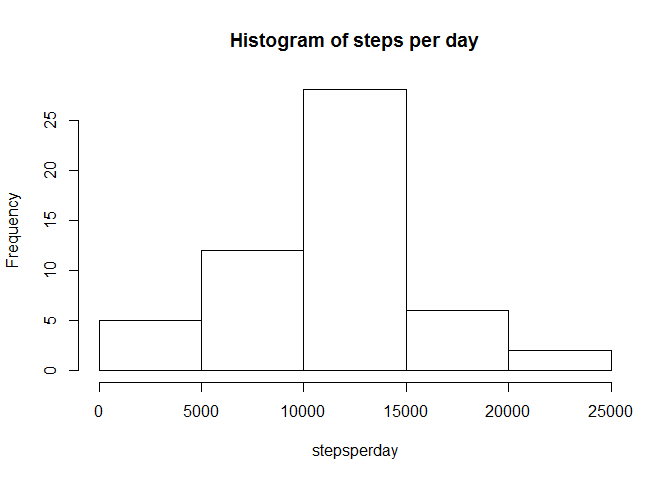
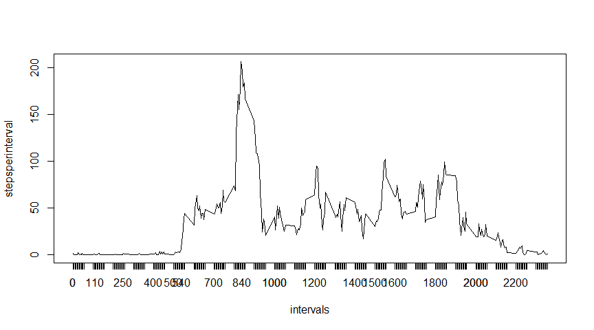
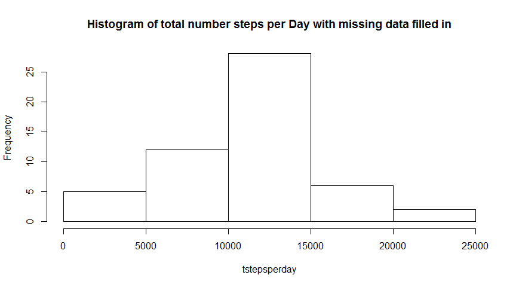
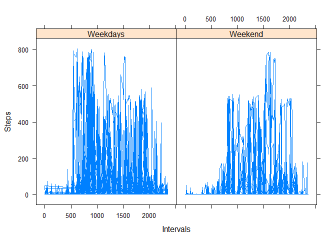

# Reproducible Research: Peer Assessment 1


## Loading and preprocessing the data

```r
oloadData=read.csv("D:/Reproducible Research/repdata-data-activity/activity.csv")
loadData<-oloadData[complete.cases(oloadData),]
cleanData<-transform(loadData, date=as.Date(date))
```
## What is mean total number of steps taken per day?
 

```
## [1] 10766.19
```

```
## [1] 10765
```

## What is the average daily activity pattern?


```r
intervals<-unique(loadData[, "interval"])
stepsperinterval<-c(1:length(intervals))

for(i in 1: length(intervals))
{
   
   
   intervalData<-cleanData[cleanData$interval==intervals[i], "steps"]
   
   avgsteps<-mean(intervalData)
   
   stepsperinterval[i]<-avgsteps
}
```
 


## Imputing missing values


 

```
## [1] 10766.19
```

```
## [1] 10765
```

## Are there differences in activity patterns between weekdays and weekends?
 
